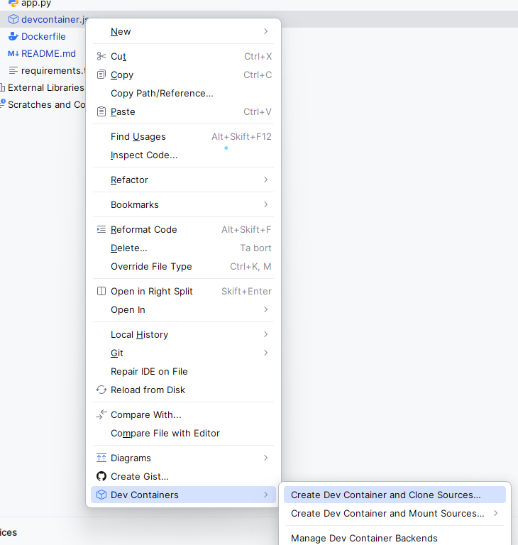

# wealthdashboard.app

This repo is for  [wealthdashboard.app](https://www.wealthdashboard.app/). 

In terminal:

docker pull python:3.10.15-slim or similar - UPDATE Dockerfile accordingly 
docker build -t "py-dev:dash_app_v1"
add/replace version numbers as needed after py-dev like: py-dev:your_project_v1

Now make sure your devcontainer.json contains the same image name as above, with exact version.
Select the devcontainer.json file, right-click and select the option Dev Containers > Create Dev Container and Clone Sources
This needs your git repo to build and creates a new image with your IDE-backend connected
When this is up and running you can connect and then it opens in a new IDE-window running in your container.
This might need a venv to be initiated from your requirements, but your image is built with exactly those and should contain just what you need.

